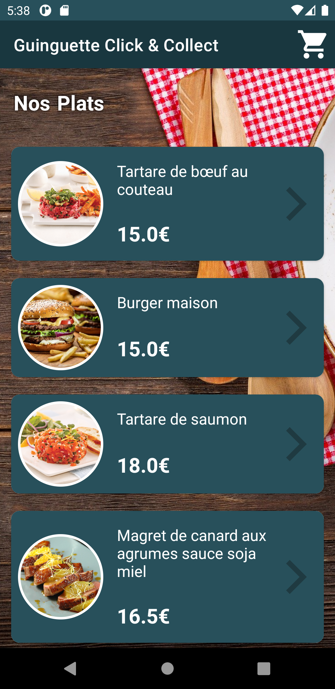
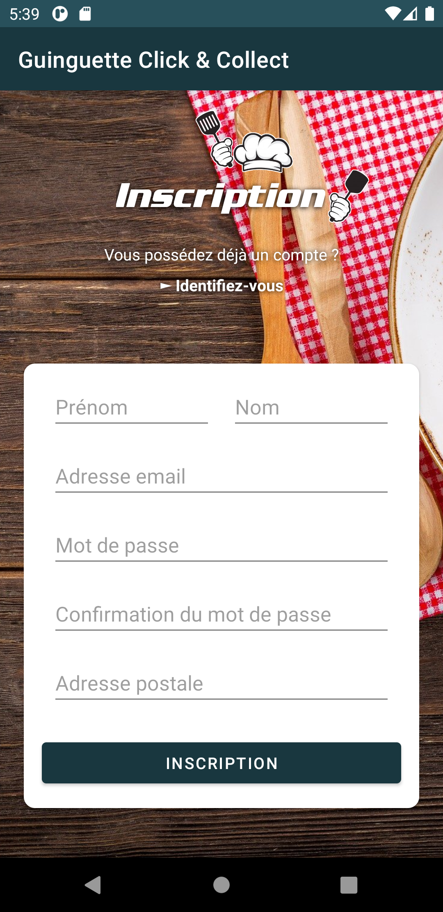
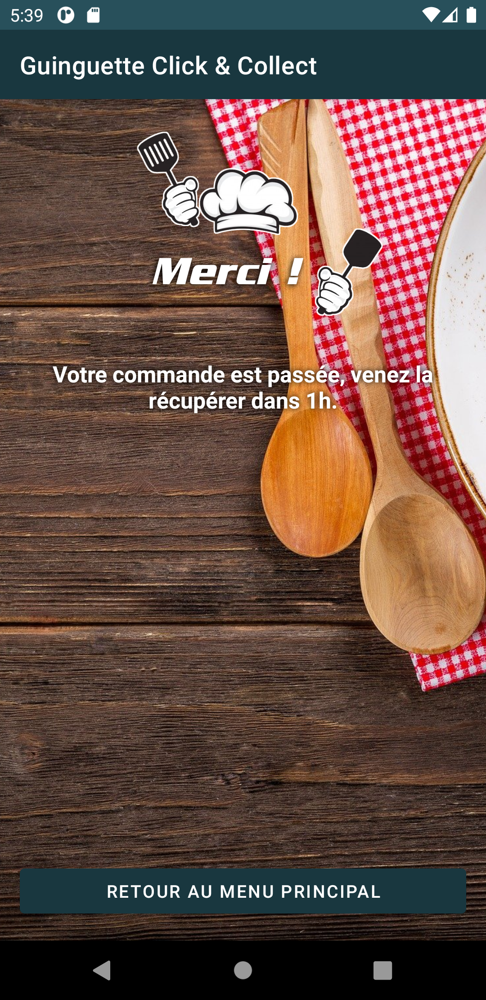

# Guinguette Click & Collect - Android App

Guinguette Click & Collect est une application réalisé lors du cours de développement Android à l'[ISEN Méditerranée](https://www.isen-mediterranee.fr/).  
Contrairement à d'autres applications, Guinguette Click & Collect est gratuite et open-source.

## À propos

L'objectif de cette application Android est de se familiariser au développement android et avec son IDE Android Studio en créant l'application AndroidERestaurant.  
En cette période de click and collect, un restaurant souhaite créer sa propre application pour proposer de réserver en ligne ses plats.  
L'objectif est de créer cette application pour ce restaurateur.

## Fonctionalité

L'application vous permet de :
- Consulter la carte du restaurant.
- D'ajouter des articles à votre panier.
- De vous identifier afin de passer commande.
- Le tout sans aucune publicité.

## Captures d'écran

